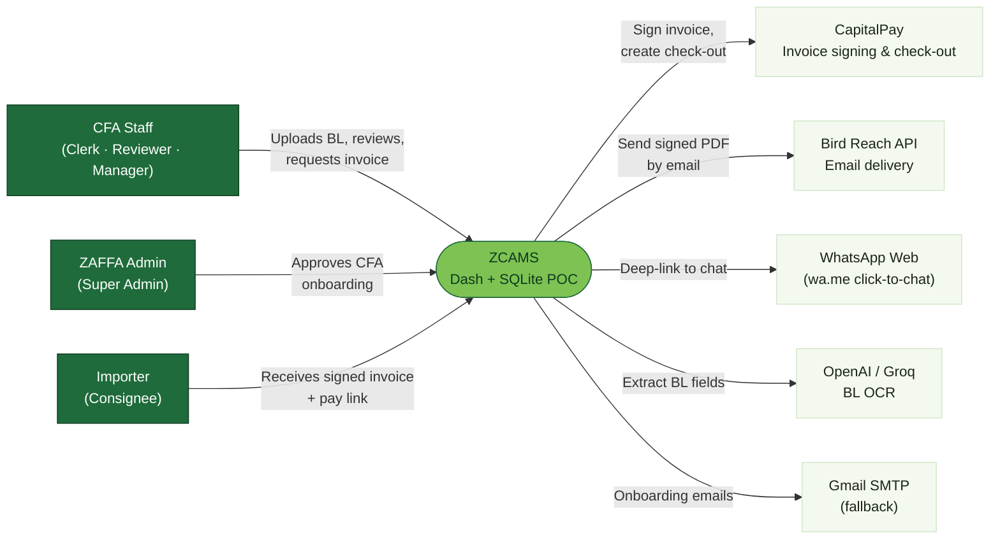
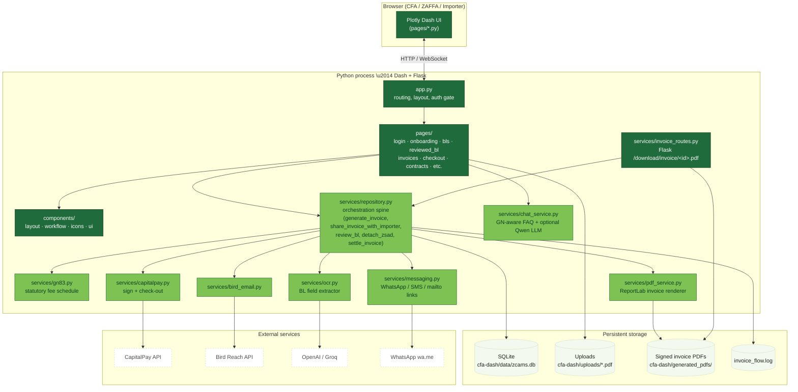
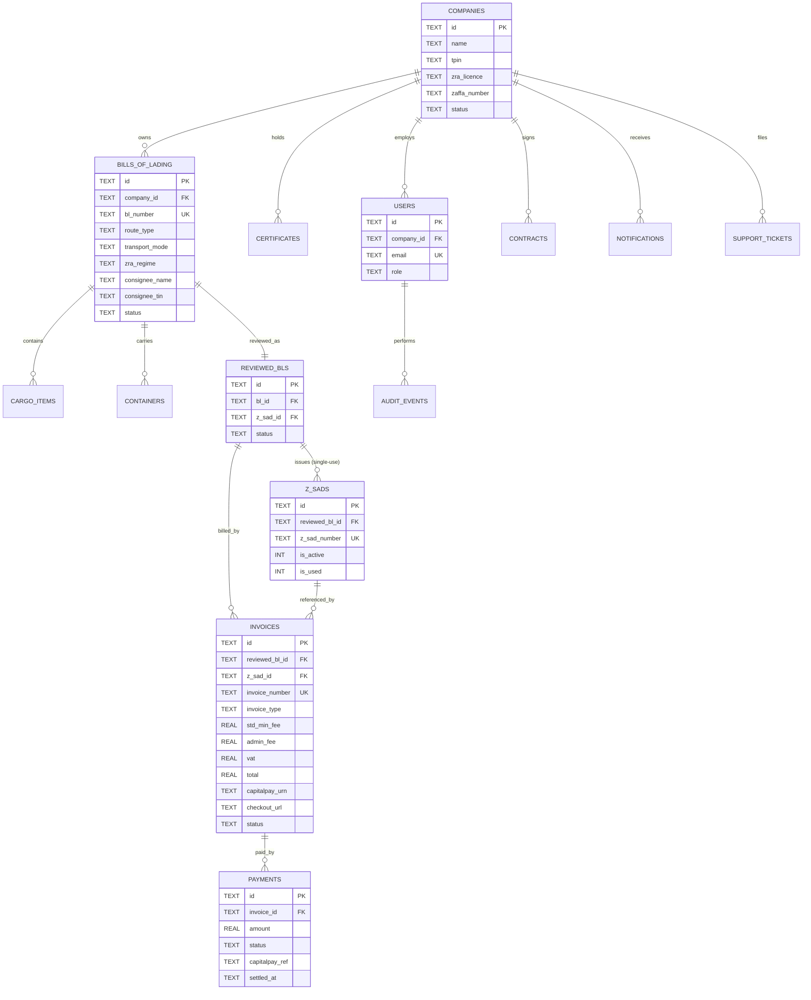
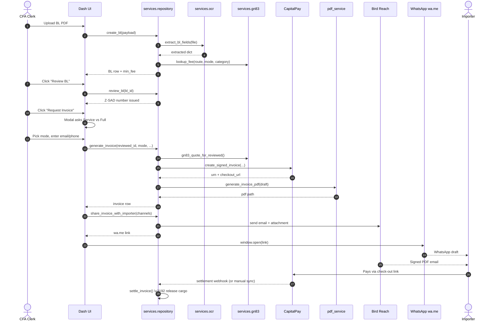
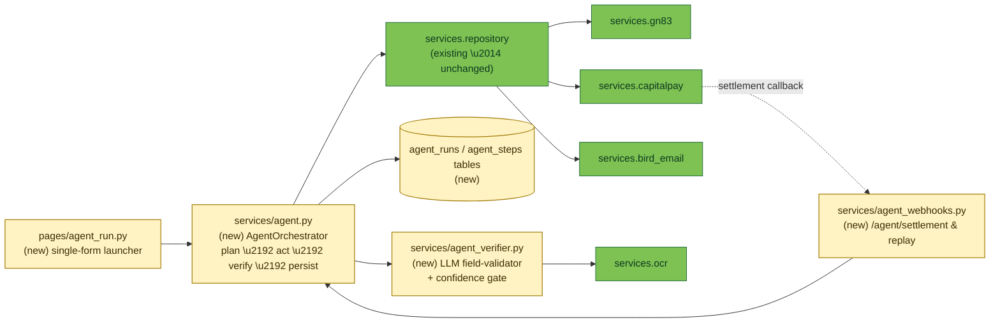
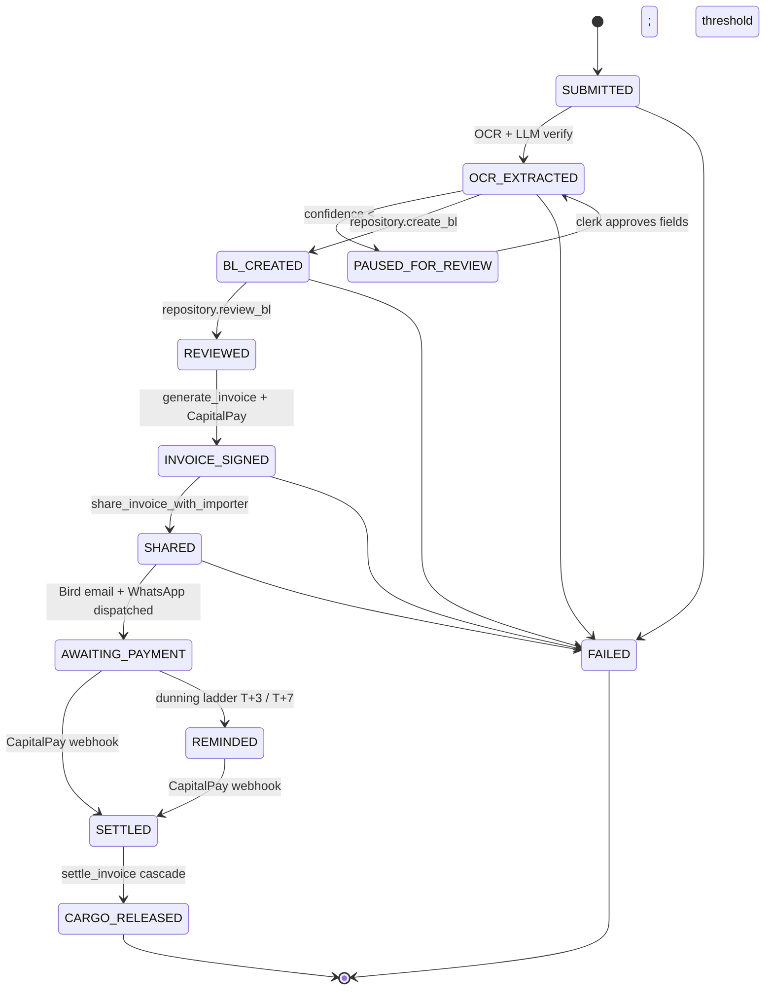

# ZCAMS Architecture & Agentic-Mode Design

This document describes the current architecture of the ZCAMS POC and proposes
an **Agentic Mode** that, given only a Bill of Lading file, a settlement mode,
and an importer email, can drive the entire clearance pipeline end-to-end with
zero human clicks.

The mermaid blocks below render in Cursor, GitHub, VS Code (with the
[Markdown Preview Mermaid Support](https://marketplace.visualstudio.com/items?itemName=bierner.markdown-mermaid)
extension), and any markdown viewer that supports mermaid.

---

## 1. System context (C4 \u2014 Level 1)

Who talks to ZCAMS and what does ZCAMS talk to.



---

## 2. Container view (C4 \u2014 Level 2)

The processes, libraries, and data stores inside ZCAMS itself.



---

## 3. Data model (ER diagram)

The SQLite schema as it stands today. Cancellation, audit, and notification
tables are shown but unrelated to the core clearance pipeline.



---

## 4. Current (manual) clearance flow

A sequence diagram of the nine-stage pipeline as it runs today. Every blue arrow
that originates from `Clerk` is a *human click*.



---

## 5. Proposed Agentic Mode (end-to-end autonomous)

Same diagram, but a single `AgentOrchestrator` replaces every human click after
the upload. The CFA submits **one form** with three inputs: BL file,
settlement mode (`SERVICE_FEE_ONLY` or `FULL_SETTLEMENT`), and the importer
email. Everything else is decided by deterministic business rules plus a small
LLM-assisted extraction step.

```mermaid
sequenceDiagram
    autonumber
    actor Clerk as CFA Clerk
    participant UI as Dash UI (single form)
    participant Agent as AgentOrchestrator
    participant Repo as services.repository
    participant OCR as services.ocr
    participant LLM as Verifier LLM<br/>(optional)
    participant CPay as CapitalPay
    participant Bird as Bird Reach
    participant Wa as WhatsApp wa.me
    actor Importer

    Clerk->>UI: Submit { BL pdf, mode, importer_email }
    UI->>Agent: start_run(input)
    Note over Agent: All steps idempotent &<br/>persisted in agent_runs / agent_steps
    Agent->>OCR: extract_bl_fields(pdf)
    OCR-->>Agent: candidate fields
    Agent->>LLM: validate &amp; normalise fields<br/>(route, mode, regime, HS)
    LLM-->>Agent: corrected fields + confidence
    Agent->>Agent: confidence < threshold ? \u2192 PAUSE &amp; notify clerk
    Agent->>Repo: create_bl(payload, auto_review=True)
    Repo-->>Agent: BL + reviewed_bl + Z-SAD
    Agent->>Repo: generate_invoice(reviewed_id, mode, beneficiary?)
    Repo->>CPay: create_signed_invoice(...)
    CPay-->>Repo: signed invoice
    Repo-->>Agent: invoice row + checkout_url
    Agent->>Repo: share_invoice_with_importer([EMAIL, WHATSAPP])
    Repo->>Bird: send signed PDF + pay link
    Repo-->>Agent: wa.me link
    Agent->>Wa: queue WhatsApp link for clerk (or skip)
    Agent-->>UI: run status \"AWAITING_PAYMENT\"
    Bird-->>Importer: signed PDF + pay link
    Importer->>CPay: settles
    CPay-->>Agent: webhook /agent/settlement
    Agent->>Repo: settle_invoice(id)
    Repo-->>Agent: cargo_release issued
    Agent-->>UI: run status \"CARGO_RELEASED\"
    Agent-->>Clerk: completion notification
```

---

## 6. Proposed Agentic Mode \u2014 component view

Where Agentic Mode plugs into the existing container diagram.



---

## 7. Agent state machine

Each `agent_run` row moves through a small, auditable state machine. Any state
can transition to `FAILED` or `PAUSED_FOR_REVIEW` so a human can take over.


